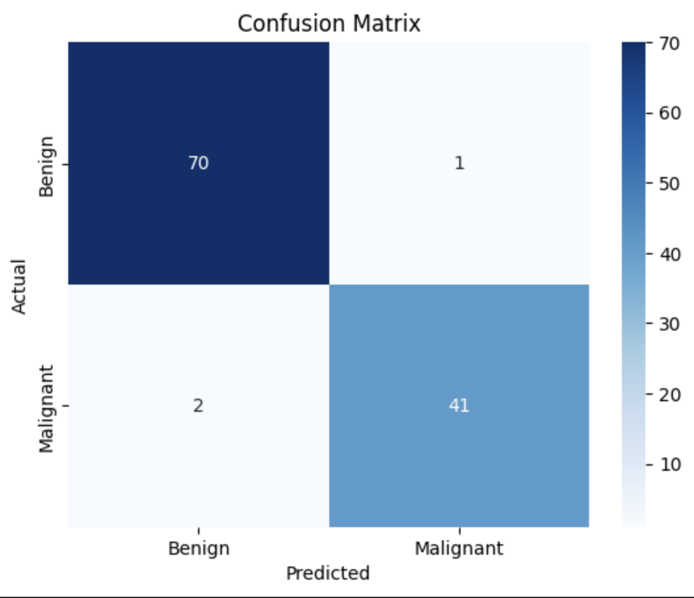

# Breast Cancer Detection (Machine Learning)

This project uses a machine learning model to classify tumors as **benign** or **malignant** based on medical data.

---

## 🧠 Concept

Breast cancer detection can be improved using machine learning.  
This project uses **Logistic Regression** to predict whether a tumor is cancerous or not.

---

## ⚙️ How it works

- Load dataset containing tumor features  
- Encode target variable (Benign / Malignant)  
- Split data into training and testing sets  
- Scale features for better performance  
- Train Logistic Regression model  
- Evaluate model using accuracy and confusion matrix  

---

## 📊 Output

### Accuracy


### Confusion Matrix


---

## 💻 Code

```python
import pandas as pd
import matplotlib.pyplot as plt
import seaborn as sns

from sklearn.model_selection import train_test_split
from sklearn.preprocessing import StandardScaler, LabelEncoder
from sklearn.linear_model import LogisticRegression
from sklearn.metrics import accuracy_score, confusion_matrix

# Load dataset
df = pd.read_csv('data.csv')

# Display first few rows of dataset
df.head()

# Encode target column
label_encoder = LabelEncoder()
df['diagnosis'] = label_encoder.fit_transform(df['diagnosis'])

# Split features and target
X = df.drop(columns=['diagnosis'])
y = df['diagnosis']

# Train-test split
X_train, X_test, y_train, y_test = train_test_split(
    X, y, test_size=0.2, random_state=42
)

# Scale features
scaler = StandardScaler()
X_train = scaler.fit_transform(X_train)
X_test = scaler.transform(X_test)

# Train model
model = LogisticRegression(max_iter=1000)
model.fit(X_train, y_train)

# Predictions
y_pred = model.predict(X_test)

# Accuracy
accuracy = accuracy_score(y_test, y_pred)
print("Accuracy:", round(accuracy, 4))

# Confusion matrix
cm = confusion_matrix(y_test, y_pred)

sns.heatmap(cm, annot=True, fmt='d', cmap='Blues',
            xticklabels=['Benign', 'Malignant'],
            yticklabels=['Benign', 'Malignant'])

plt.xlabel("Predicted")
plt.ylabel("Actual")
plt.title("Confusion Matrix")
plt.show()
```
---

## 🚀 Technologies Used

- Python  
- Pandas  
- NumPy  
- Scikit-learn  
- Matplotlib  
- Seaborn

---

## 📌 Future Improvements

- Use advanced models like Random Forest or Support Vector Machines  
- Perform feature selection to improve model performance  
- Tune hyperparameters for better accuracy  
- Deploy the model as a web application  
- Integrate real-time medical data for prediction  
